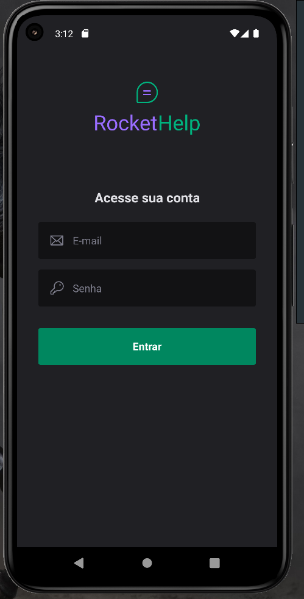

# Aplicação mobile RocketHelp; Ignite Lab React Native

Essa aplicação consiste em uma aplicação mobile para solicitações de chamado.!

A plataforma utiliza o **Expo** para fazer o desenvolvimento mobile e o **Firebase** para guardar as informações das patrimônio, descrição do problema, solução, data de criação e de conclusão, etc. 

## Tecnologias/serviços utilizados

- React Native
- Firebase
- Expo
- Typescript
- Native Base

